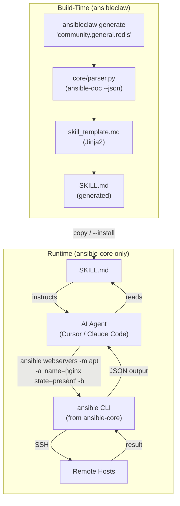
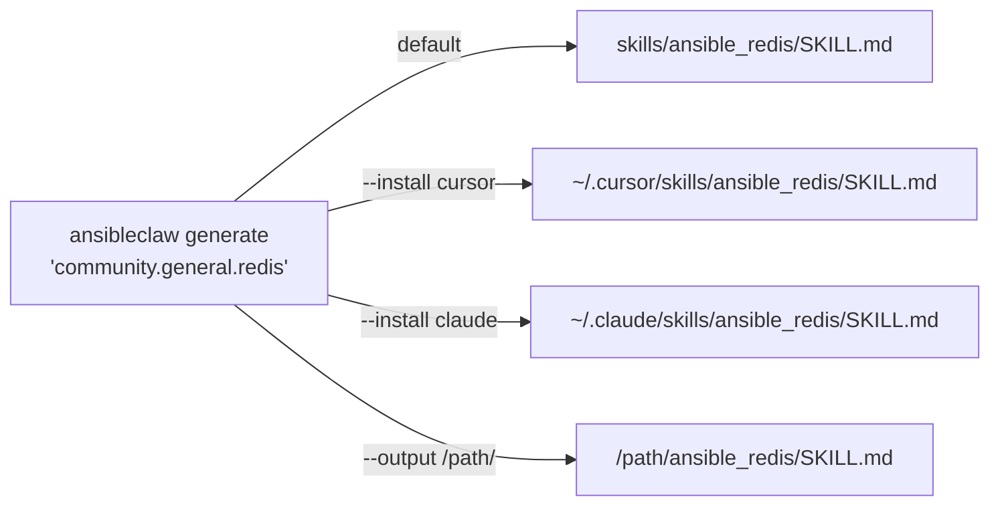
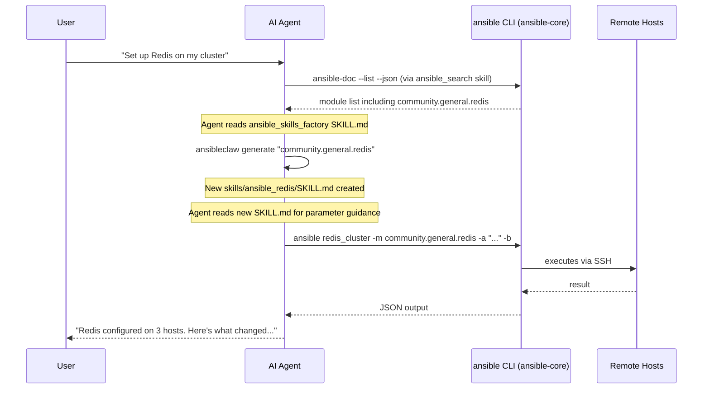

# AnsibleClaw Implementation Plan

## What We're Building

A **skill generation framework** for AI agents, with a clean separation:

- **Build-time** (`ansibleclaw`, this project) -- A Python tool that scrapes `ansible-doc` and generates rich SKILL.md files from Ansible module documentation. Operators and AI agents run this to expand capabilities.
- **Runtime** (`ansible-core` only) -- Generated SKILL.md files teach the AI to use standard `ansible` and `ansible-doc` commands. The only system requirement is `ansible-core`, a mainstream package many systems already have.

Three design principles:

- **Portable skills** -- Copy a generated SKILL.md into `~/.cursor/skills/`, `~/.claude/skills/`, or any agent's skill directory. It works with just `ansible-core` installed. No custom runtime dependency.
- **No pre-conversion** -- AI agents already have native file/CLI capabilities. The general-purpose manager skill teaches `ansible` ad-hoc commands for any module. The factory generates specialized skills on-demand.
- **Standard tooling** -- Skills reference `ansible`, `ansible-doc`, and `ansible-playbook` -- commands every Ansible user knows. No proprietary CLI wrapping standard tools.

## Directory Structure

```
AnsibleClaw/
├── src/
│   └── ansibleclaw/                # Build-time tool (pip install for generating skills)
│       ├── __init__.py
│       ├── cli.py                  # CLI: ansibleclaw generate / search / ui
│       ├── config.py               # Configuration
│       ├── core/
│       │   ├── __init__.py
│       │   └── parser.py           # ansible-doc scraping & parameter extraction
│       └── web/                    # Web UI (optional: pip install ansibleclaw[ui])
│           ├── __init__.py
│           ├── app.py              # FastAPI app + routes
│           ├── templates/          # Jinja2 HTML templates
│           │   ├── base.html       # Layout with nav + Pico CSS + HTMX
│           │   ├── skills.html     # Skills library page
│           │   ├── search.html     # Module search page
│           │   ├── generate.html   # Generate & preview page
│           │   └── inventory.html  # Inventory management page
│           └── static/             # Minimal static assets (if needed)
│               └── style.css
├── skills/                         # All skills (built-in + OOTB + factory-generated)
│   ├── ansible_manager/            # General-purpose executor
│   │   └── SKILL.md               # Teaches AI to use `ansible` CLI
│   ├── ansible_search/             # Module discovery
│   │   └── SKILL.md               # Teaches AI to use `ansible-doc`
│   ├── ansible_skills_factory/     # On-demand skill generator
│   │   └── SKILL.md               # Teaches AI to use `ansibleclaw generate`
│   └── ansible_package/            # OOTB showcase
│       └── SKILL.md               # Module-specific docs for ansible.builtin.package
├── inventory/                      # Ansible inventory
│   ├── hosts.yml
│   └── group_vars/
│       └── all.yml
├── library/
│   └── templates/
│       └── skill_template.md       # Jinja2 blueprint for generated skills
├── tests/
│   ├── conftest.py
│   ├── test_parser.py
│   ├── test_cli.py
│   └── test_template.py
├── ansible.cfg                     # Ansible defaults (inventory path, JSON callback)
├── pyproject.toml                  # Package definition
└── README.md
```

## Architecture



## Skill Distribution Flow



## Operational Workflow



## Component Specs

### 1. `pyproject.toml` -- Package Definition

```toml
[project]
name = "ansibleclaw"
version = "0.1.0"
requires-python = ">=3.10"
dependencies = [
    "ansible-core>=2.15",
    "jinja2>=3.1",
    "pyyaml>=6.0",
]

[project.scripts]
ansibleclaw = "ansibleclaw.cli:main"

[project.optional-dependencies]
ui = ["fastapi>=0.110", "uvicorn>=0.29", "python-multipart>=0.0.9"]
dev = ["pytest>=7.0"]
```

Core dependencies are minimal: `ansible-core` (for `ansible-doc`), Jinja2 (templates), PyYAML. The web UI is optional via `pip install ansibleclaw[ui]`.

### 2. `src/ansibleclaw/cli.py` -- CLI Entrypoint

Three subcommands:

- **`ansibleclaw generate`** (primary) -- Generate a specialized skill from ansible-doc
  ```
  ansibleclaw generate "community.general.redis"
  ansibleclaw generate "community.general.redis" --install cursor
  ansibleclaw generate "community.general.redis" --output /custom/path/
  ```
  Scrapes `ansible-doc --json` via `core.parser`, renders `skill_template.md`, writes SKILL.md.

  `--install` maps platform names to paths:
  - `cursor` -> `~/.cursor/skills/`
  - `claude` -> `~/.claude/skills/`

  Default (no flag): writes to `skills/` in the project directory.

- **`ansibleclaw search`** (convenience) -- Quick module search
  ```
  ansibleclaw search "redis"
  ansibleclaw search --detail "community.general.redis"
  ```
  Wraps `ansible-doc --list --json` with keyword filtering. Convenience for operators; at runtime, the AI uses `ansible-doc` directly as taught by the search skill.

- **`ansibleclaw ui`** -- Launch the web management dashboard
  ```
  ansibleclaw ui                    # starts on http://localhost:8600
  ansibleclaw ui --port 9000        # custom port
  ```
  Starts a local FastAPI server. Requires `pip install ansibleclaw[ui]`. Gracefully errors if FastAPI is not installed.

### 3. `src/ansibleclaw/core/parser.py` -- Doc Scraper

The heart of the factory. Wraps `ansible-doc` to extract structured module information.

- `get_module_doc(module_name: str) -> dict` -- runs `ansible-doc <module> --json`, returns parsed JSON
- `list_modules(namespace: str = None) -> list[dict]` -- runs `ansible-doc --list --json`, filterable by keyword
- `extract_params(doc: dict) -> list[dict]` -- parameter specs (name, type, required, default, choices, description)
- `extract_examples(doc: dict) -> list[str]` -- example YAML snippets

### 4. `src/ansibleclaw/config.py` -- Configuration

- `SKILLS_DIR`: default output for generated skills (default: `skills/`)
- `INSTALL_PATHS`: platform name -> skill directory mapping (`cursor` -> `~/.cursor/skills/`, `claude` -> `~/.claude/skills/`)
- Reads from environment variables with sensible defaults

### 5. `ansible.cfg` -- Ansible Defaults

Project-level Ansible configuration so commands run from the project directory "just work":

```ini
[defaults]
inventory = inventory/hosts.yml
stdout_callback = json
```

This means: any `ansible` command run from the AnsibleClaw project directory automatically uses the local inventory and returns JSON output. No `-i` or `ANSIBLE_STDOUT_CALLBACK` needed.

### 6. Built-In Skills

Three built-in SKILL.md files that teach the AI to use standard Ansible tooling:

**`skills/ansible_manager/SKILL.md`** -- The Executive

Teaches the AI to execute any Ansible module using the standard `ansible` CLI:

- Ad-hoc command syntax: `ansible <host-pattern> -m <module> -a "<args>"`
- Key flags: `-b` (become/sudo), `--check` (dry-run), `--diff` (show changes)
- Common patterns: install packages, manage services, create users, configure files
- When NOT to use Ansible (basic local file/CLI ops the agent handles natively)
- How to read `inventory/hosts.yml` to understand available hosts
- Safety: always `--check --diff` first for destructive operations
- **Inventory portability section**: when working outside the AnsibleClaw project, use `-i /path/to/inventory`, set `ANSIBLE_INVENTORY` env var, or use `/etc/ansible/hosts`
- Notes that `ansible.cfg` in the project sets JSON callback + default inventory automatically

**`skills/ansible_search/SKILL.md`** -- The Scout

Teaches the AI to discover Ansible modules using `ansible-doc`:

- **Namespace-first strategy**: always start with `ansible-doc --list <namespace>` (e.g., `ansible-doc --list community.docker`) to avoid dumping 3000+ modules
- Get full docs: `ansible-doc <module> --json`
- How to read parameter specs, required fields, and examples from the output
- When to escalate to the factory (complex modules needing a dedicated skill)

**`skills/ansible_skills_factory/SKILL.md`** -- The Architect

Teaches the AI to generate new specialized skills on-demand:

- Invocation: `ansibleclaw generate "<module_name>"`
- Install to agent: `ansibleclaw generate "<module_name>" --install cursor`
- CLI prints the output path after generation so the AI can read the new SKILL.md immediately
- When to generate (complex parameters, repeated use) vs. just using the manager skill
- The self-expansion workflow: search -> generate -> read new SKILL.md -> use

Note: This is the one skill that requires `ansibleclaw` to be installed. The other two only need `ansible-core`.

### 7. `library/templates/skill_template.md` -- Skill Blueprint

Jinja2 template rendered by `ansibleclaw generate`. Produces a SKILL.md that references `ansible` CLI commands (not `ansibleclaw`):

- Frontmatter: `name`, `description` (from ansible-doc short_description)
- Module purpose and when to use it
- Parameters table (name, type, required, default, choices, description)
- Usage examples using `ansible` CLI syntax:
  ```
  ansible <hosts> -m <module> -a "<example_args>" -b --check --diff
  ```
- **Inventory portability section**: documents `-i`, `ANSIBLE_INVENTORY`, and `ansible.cfg` options
- Safety notes: `--check`, `--diff`, become requirements, idempotency

### 8. OOTB Showcase: `ansible.builtin.package`

Pre-generated during the build via `ansibleclaw generate "ansible.builtin.package"`. Lives at `skills/ansible_package/SKILL.md`.

The generated SKILL.md teaches the AI:

- How to install/remove packages: `ansible webservers -m ansible.builtin.package -a "name=nginx state=present" -b`
- Parameters: `name`, `state` (present/absent/latest), `use` (auto/apt/yum/dnf)
- OS-agnostic behavior (auto-detects package manager)
- Requires `become: true` (package management needs root)
- Always `--check` first for removals
- Inventory portability guidance (inherited from template)

### 9. `inventory/` -- Example Fleet

Provides a starter inventory so the AI has something to work with:

- `hosts.yml`: localhost + example host groups
- `group_vars/all.yml`: default connection vars (ansible_user, ansible_connection)
- `ansible_connection: local` for the control node itself

### 10. Tests

- **test_parser.py**: Mock `subprocess.run` for `ansible-doc`, verify parameter extraction, module listing
- **test_cli.py**: Test `ansibleclaw generate` end-to-end -- mock ansible-doc, verify SKILL.md output, verify output path is printed
- **test_template.py**: Verify template rendering produces valid SKILL.md with correct frontmatter, ansible CLI examples, parameter table, inventory portability section

### 11. Web UI (`src/ansibleclaw/web/`)

A local web dashboard launched via `ansibleclaw ui`. Built with FastAPI + Jinja2 templates + HTMX + Pico CSS. No JS build step -- pure Python with CDN-loaded frontend libraries.

**`app.py`** -- FastAPI application with routes:

- `GET /` -- redirect to skills library
- `GET /skills` -- list all skills from `config.SKILLS_DIR`, read their frontmatter
- `GET /skills/{name}` -- view a skill's SKILL.md content rendered as HTML
- `DELETE /skills/{name}` -- delete a skill directory
- `POST /skills/{name}/install` -- copy skill to agent directory (accepts platform: cursor/claude)
- `GET /search` -- module search page
- `GET /search/results?q=redis&ns=community.general` -- HTMX partial: returns filtered module list (calls `core.parser.list_modules()`)
- `GET /search/detail/{module}` -- HTMX partial: returns module details (calls `core.parser.get_module_doc()`)
- `POST /generate` -- generate a skill: accepts module name + target, calls the same logic as `cli.py generate`, returns preview or confirmation
- `GET /generate/preview?module=...` -- HTMX partial: renders a preview of the SKILL.md that would be generated
- `GET /inventory` -- view current inventory parsed from `hosts.yml`
- `PUT /inventory` -- save edited inventory YAML

**Templates (Jinja2 + HTMX)**:

- `base.html` -- shared layout: nav bar (Skills / Search / Generate / Inventory), Pico CSS via CDN, HTMX via CDN
- `skills.html` -- table of skills with view/delete/install actions. HTMX-powered delete (no page reload).
- `search.html` -- search bar with namespace dropdown. Results load via HTMX into a results div. Each result row has a "Generate Skill" button.
- `generate.html` -- module name input (with autocomplete from search), target selector (project/Cursor/Claude/custom), live preview pane that updates via HTMX as you type, confirm button.
- `inventory.html` -- code editor (textarea or lightweight editor like CodeMirror via CDN) showing `hosts.yml`, save button.

**Design**: Pico CSS provides a clean, minimal look with zero custom CSS needed for basics. Dark/light mode support built-in. HTMX handles all dynamic interactions without writing JavaScript.

## Dependency Summary

- **Core** (`pip install ansibleclaw`): `ansible-core`, `jinja2`, `pyyaml`
- **Web UI** (`pip install ansibleclaw[ui]`): adds `fastapi`, `uvicorn`, `python-multipart`
- **Runtime** (on target machines): `ansible-core` only
- **Dev** (`pip install ansibleclaw[dev]`): adds `pytest`

## Build Order

### Phase 1: Core CLI

1. **Scaffolding** -- pyproject.toml, package structure, ansible.cfg, inventory, README
2. **core/parser.py** -- ansible-doc scraping (foundation for everything)
3. **skill_template.md** -- Jinja2 blueprint referencing `ansible` CLI, with inventory portability section
4. **cli.py** -- `ansibleclaw generate` (prints output path) and `ansibleclaw search`
5. **ansible_manager SKILL.md** -- teaches `ansible` CLI ad-hoc execution + inventory portability
6. **ansible_search SKILL.md** -- teaches `ansible-doc` with namespace-first filtering
7. **ansible_skills_factory SKILL.md** -- teaches `ansibleclaw generate` + immediate SKILL.md reading
8. **OOTB showcase** -- run `ansibleclaw generate "ansible.builtin.package"` to validate full pipeline
9. **Tests** -- parser, CLI, template rendering

### Phase 2: Web UI

10. **FastAPI backend** -- `web/app.py` with all routes, reusing `core.parser` and `config`
11. **HTML templates** -- base layout + skills/search/generate/inventory pages with HTMX interactions
12. **`ansibleclaw ui` subcommand** -- wire up uvicorn in cli.py, graceful error if FastAPI not installed
